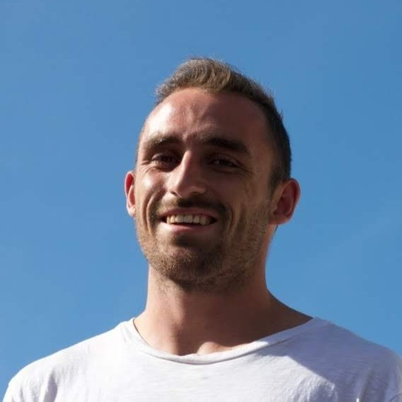

## About

Claude is a motivated young South African, passionate about finding ways to unlock the potential in Africa. Claude is currently working towards a Masters degree in the field of Artificial Intelligence. He is actively doing research for an innovative UK-based AI company, InstaDeep. His research is focused on Multi-Agent Reinforcement learning, a cutting-edge sub-field of Machine Learning. Claude believes that AI has the potential to unlock a lot of real-world value and solve a number of incredibly tough problems. Claude is committed towards playing his part in ensuring South Africa keeps up with this rapidly developing field and believes in empowering as many South Africans as possible to become active contributors towards the field of AI. To this end, Claude is also a motivated teacher. He actively tutors mathematics at a high school and university level, and says that it is incredibly rewarding to help other students see the power in mathematics and computer science. 

